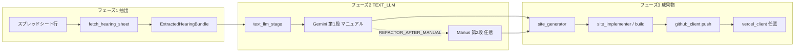

# mac-mini-bot

Google スプレッドシートの案件を読み、**抽出 → TEXT_LLM（プラン別 Gemini マニュアル）→ Next.js 生成・ビルド → GitHub push → Vercel** までをオーケストレーションする常駐用ボットです。

## 派生版 `mac-mini-bot-v2` と LLM 2 段実装

本リポジトリの**開発主軸**は Git ブランチ **`mac-mini-bot-v2`** とする派生ラインです（上流 `main` とは PR マージより **派生として並行開発**する想定）。

| 用語 | 意味 |
|------|------|
| **LLM 2 段** | **第 1 段: Gemini**（`config/prompts/*_manual/` のマニュアル多段チェーンで仕様・Canvas 相当を生成）→ **第 2 段: Manus**（`config/prompts/manus/` でリファクタ・画像・build・GitHub push。プラン別 `*_REFACTOR_AFTER_MANUAL` と `MANUS_API_KEY` で有効化） |
| **目指す姿** | 案件フェーズ 2 の `run_text_llm_stage` 内で、上記 2 段を**手作業マニュアルと同じプロンプト構成**で安定運用できること（I/O と環境変数は `docs/LLM_PIPELINE.md`） |

`main` へ取り込むかは別として、**ドキュメント・プロンプトの更新は v2 ラインを正**として進めます。`main` の変更を取り込む場合は `git fetch origin && git merge origin/main`（または rebase）で同期してください。

## 開発を始める（最短）

```bash
python3 -m venv .venv
source .venv/bin/activate   # Windows: .venv\Scripts\activate
pip install -r requirements.txt -r requirements-dev.txt
pytest
BOT_CONFIG_CHECK=1 python main.py   # .env 必須。Sheets 列見出しも確認
```

- **常に venv の Python で実行**（`python3 main.py` だけだと依存不足になりがちです）。
- 環境変数の一覧は **`.env.example`**。実キーは **`.env`**（リポジトリに含めない）。
- 詳細手順: **`SETUP.md`**。別マシン・本番: **`DEPLOYMENT.md`**。

## アーキテクチャ（データの流れ）



| 拡張したいこと | 主に触る場所 |
|----------------|--------------|
| 実 LLM（要望・仕様） | `modules/llm/text_llm_stage.py`（`if/elif` → 各 `*_gemini_manual.py`） |
| ヒアリング前処理・構造化 | `modules/case_extraction.py` |
| 列レイアウト・見出し検証 | `config/config.py` の `SPREADSHEET_COLUMNS` / `SPREADSHEET_HEADER_LABELS`（**AV・AW は見出し不要**） |
| 共通技術ルール（仕様・実装） | `config/config.py` の `COMMON_TECHNICAL_SPEC` / `config/prompts/common/technical_spec_prompt_block.txt`（サイト出力は `TECH_REQUIREMENTS.md`） |

## エラー処理の原則（必須）

- **正常ルート以外でのフォールバックは禁止**（失敗を握りつぶして続行しない）。
- 失敗時は **`RuntimeError` 等で明示的に例外**とし、メッセージに **モジュール・処理が分かる文言**を含める（例: `modules.llm.text_llm_stage` / `modules.llm.llm_pipeline_common`）。

## 本番実行

```bash
source .venv/bin/activate
python main.py
```

- 試験で **1 件だけ**: `BOT_MAX_CASES=1 python main.py`

## 品質・Lint

```bash
pytest
ruff check main.py config/ modules/ tests/   # リポジトリ全体（UP 等の指摘が出る場合あり）
```

CI（`.github/workflows/ci.yml`）は **限定パス**で `ruff` と `pytest` を実行しています。

## ドキュメント索引

| 文書 | 内容 |
|------|------|
| **`PIPELINE_TESTING.md`** | **工程テスト・段階 Gemini テスト**のまとめ（ディレクトリ説明・コマンド早見・検証知見） |
| **`docs/DIRECTORY_GUIDE.md`** | **リポジトリの地図**（工程とフォルダの対応） |
| **`docs/OUTPUT_LAYOUT.md`** | **実行時 `output/sites/...` の中身**（工程テスト向け） |
| `docs/LLM_PIPELINE.md` | **LLM 2 段**（Gemini / Manus）と案件フェーズの対応 |
| `docs/llm-input-reference/` | プロンプト由来のルールをジャンル別に整理した索引 |
| `docs/README.md` | `docs/` 内の短い索引 |
| `modules/README.md` | `modules/` のパイプライン順インデックス |
| `SETUP.md` | 認証・スプレッドシート列・定期実行など |
| `DEPLOYMENT.md` | 別 PC への複製チェックリスト |
| `docs/TECH_REQUIREMENTS.md` | 生成サイトの技術・デザイン制約（リポジトリ内参照用。実行時は `output/sites/.../TECH_REQUIREMENTS.md` も生成） |
| `.env.example` | 環境変数テンプレート |

## 処理フロー（概要）

1. スプレッドシートから対象行取得（フェーズ・必須列・AV ステータス等）
2. **抽出**: `extract_hearing_bundle`
3. **TEXT_LLM**: `run_text_llm_stage` → `requirements_result` + `spec`（**Gemini マニュアル必須**。任意で **Manus 第 2 段**でリファクタ・push URL。詳細は `docs/LLM_PIPELINE.md`）
4. Next.js 土台生成 → 実装パスならビルド検証
5. **GitHub にソース push** → 既定どおり Vercel → AW に URL 記録

### AV 列が「エラー: …」になるとき

例外メッセージが AV に短縮表示されます。本文が切れる場合は `SPREADSHEET_AI_STATUS_ERROR_MAX_LEN` を調整してください。

## リポジトリ構成（抜粋）

詳細は **`docs/DIRECTORY_GUIDE.md`**。抜粋だけ挙げます。

- `main.py` — オーケストレーション
- `config/` — 環境・列定義・**`prompts/`**（Gemini マニュアル・Manus 文面）
- `modules/` — パイプライン実装（一覧は **`modules/README.md`**）
- `output/` — 実行時のサイト出力（既定・git 対象外。中身は **`docs/OUTPUT_LAYOUT.md`**）
- `docs/` — LLM 割当・ディレクトリ案内など
- `tests/` — pytest

（サイト正本は **Gemini/Manus のフェンス出力の適用**が中心です。`TEMPLATE_DIR` は `.env` で指定できますが、現状の `main` フローではテンプレコピーは行いません。）
