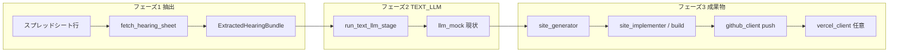

# mac-mini-bot

Google スプレッドシートの案件を読み、**抽出 → TEXT_LLM（現状モック）→ Next.js 生成・ビルド → GitHub push → Vercel** までをオーケストレーションする常駐用ボットです。

## 開発を始める（最短）

```bash
python3 -m venv .venv
source .venv/bin/activate   # Windows: .venv\Scripts\activate
pip install -r requirements.txt -r requirements-dev.txt
pytest
BOT_CONFIG_CHECK=1 python main.py   # .env 必須。Sheets 列見出しも確認
```

- **常に venv の Python で実行**（`python3 main.py` だけだと依存不足になりがちです）。
- 環境変数の一覧は **`.env.example`**。実キーは **`.env`**（リポジトリに含めない）。
- 詳細手順: **`SETUP.md`**。別マシン・本番: **`DEPLOYMENT.md`**。

## アーキテクチャ（データの流れ）



| 拡張したいこと | 主に触る場所 |
|----------------|--------------|
| 実 LLM（要望・仕様） | `modules/text_llm_stage.py`（現状は `llm_mock` 委譲） |
| ヒアリング前処理・構造化 | `modules/case_extraction.py` |
| 列レイアウト・見出し検証 | `config/config.py` の `SPREADSHEET_COLUMNS` / `SPREADSHEET_HEADER_LABELS`（**AV・AW は見出し不要**） |
| 共通技術ルール（仕様・実装） | `config/config.py` の `COMMON_TECHNICAL_SPEC` / `docs/TECH_REQUIREMENTS.md` |
| 画像テンプレ文言 | `config/prompts/image_generation/`（`config/prompts/README.md`） |

## エラー処理の原則（必須）

- **正常ルート以外でのフォールバックは禁止**（失敗を握りつぶして続行しない）。
- 失敗時は **`RuntimeError` 等で明示的に例外**とし、メッセージに **モジュール・処理が分かる文言**を含める（例: `modules.text_llm_stage` / `modules.llm_mock`）。

## 本番実行

```bash
source .venv/bin/activate
python main.py
```

- 試験で **1 件だけ**: `BOT_MAX_CASES=1 python main.py`
- 画像だけスキップ: `python main.py --skip-images` または `IMAGE_GEN_SKIP_RUN=1`

## 品質・Lint

```bash
pytest
ruff check main.py config/ modules/ tests/   # リポジトリ全体（UP 等の指摘が出る場合あり）
```

CI（`.github/workflows/ci.yml`）は **限定パス**で `ruff` と `pytest` を実行しています。

## ドキュメント索引

| 文書 | 内容 |
|------|------|
| `SETUP.md` | 認証・スプレッドシート列・定期実行など |
| `DEPLOYMENT.md` | 別 PC への複製チェックリスト |
| `docs/TECH_REQUIREMENTS.md` | 生成サイトの技術・デザイン制約 |
| `.env.example` | 環境変数テンプレート |

## 処理フロー（概要）

1. スプレッドシートから対象行取得（フェーズ・必須列・AV ステータス等）
2. **抽出**: `extract_hearing_bundle`
3. **TEXT_LLM**: `run_text_llm_stage` → `requirements_result` + `spec`（現状モック）
4. Next.js 土台生成 → 実装パスなら `docs/` メタとビルド検証
5. 任意で PIL 画像 → **GitHub にソース push** → 既定どおり Vercel → AW に URL 記録

### AV 列が「エラー: …」になるとき

例外メッセージが AV に短縮表示されます。本文が切れる場合は `SPREADSHEET_AI_STATUS_ERROR_MAX_LEN` を調整してください。

## リポジトリ構成（抜粋）

- `main.py` — オーケストレーション
- `modules/case_extraction.py` — ヒアリング類の抽出
- `modules/text_llm_stage.py` — TEXT_LLM 工程の入口
- `modules/llm_mock.py` — 現状のモック実装
- `modules/spreadsheet.py` — Sheets 読み書き（**書き込みは AV・AW のみ**）
- `modules/site_generator.py` / `site_implementer.py` / `site_build.py` — サイト生成・検証
- `templates/nextjs_template/` — Next.js コピー元
