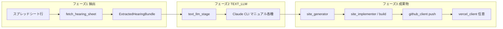

# mac-mini-bot

**LLM の全入出力を記録し、プロンプトの反復改善でサイト生成品質を上げ続ける半 AI ワークフローシステム**です。

Google スプレッドシートの案件を起点に、**ヒアリング抽出 → Claude CLI 多段チェーン（プラン別 10〜16 回）→ Manus リファクタ → Next.js ビルド → GitHub push → Vercel デプロイ**を自動実行します。全 LLM 呼び出しの入出力は `output/<レコード番号>/llm_steps/` に自動保存され、プロンプト改善の根拠データとして蓄積されます。

### このシステムの核心

1. **多段 LLM チェーンによる品質制御** — 「サイトを作って」と 1 回頼むのではなく、人間の制作マニュアルを **情報設計 → コンテンツ → デザイン → コード** にステップ分解し、各段階の出力品質を制御する
2. **全入出力の自動記録** — Claude CLI・Manus の全呼び出しの入出力をコード変更なしに自動保存。失敗（`error.txt`）も記録する
3. **記録に基づく自己改善サイクル** — 蓄積された入出力データを人間がレビューし、`config/prompts/*.txt` のルールを改善。工程スナップショットで同じ入力に対して改善版を A/B 検証できる

```
 記録に基づく自己改善サイクル

 ① 案件実行（Sheets → Claude CLI 多段 → Manus → Deploy）
      ↓
 ② 全入出力の記録（output/<record>/llm_steps/）
      ↓
 ③ 人間がレビュー（生成品質・エラー・プロンプト効果）
      ↓
 ④ プロンプト改善（config/prompts/*.txt を編集・git で差分管理）
      ↓
 ⑤ 工程リプレイで検証（phase1/phase2 スナップショット）
      ↓
 ① に戻る
```

## 開発を始める（最短）

```bash
python3 -m venv .venv
source .venv/bin/activate   # Windows: .venv\Scripts\activate
pip install -r requirements.txt -r requirements-dev.txt
pytest
BOT_CONFIG_CHECK=1 python main.py   # .env 必須。Sheets 列見出しも確認
```

- **常に venv の Python で実行**（`python3 main.py` だけだと依存不足になりがちです）。
- 環境変数の一覧は **`.env.example`**。実キーは **`.env`**（リポジトリに含めない）。
- 詳細手順: **`SETUP.md`**。別マシン・本番: **`DEPLOYMENT.md`**。

## アーキテクチャ

### パイプライン（データの流れ）



### 品質管理の多層防御

| 層 | 仕組み | 場所 |
|----|--------|------|
| プロンプト設計 | 手順ごとのステップファイルで LLM の出力方向を制御 | `config/prompts/*_manual/step_*.txt` |
| 技術共通仕様 | 過去の品質問題から蒸留した 74 行のガードレール | `config/prompts/common/technical_spec_prompt_block.txt` |
| チェーン構造 | 前ステップの出力を次の入力に渡し、品質を段階的に積み上げ | 各 `*_claude_manual.py` |
| 出力異常検出 | 空応答検出、プレースホルダ未置換で `RuntimeError` | `_extract_cli_text` / `_subst` |
| ビルド検証 | `npm run build` + `page.tsx` 本数と契約ページ数の突合 | `site_build.py` |
| 全入出力記録 | 全 LLM ステップの `input.md` / `output.md` / `error.txt` | `llm_step_trace.py` → `output/` |

### 改善するときに触る場所

| 改善したいこと | 主な場所 |
|----------------|----------|
| LLM の生成品質（全般） | `config/prompts/common/technical_spec_prompt_block.txt`（全プラン共通ガードレール） |
| 特定ステップの生成品質 | `config/prompts/*_manual/step_*.txt`（手順ファイルを編集） |
| プラン別チェーンの構造変更 | `modules/*_claude_manual.py`（CLI 呼び出し回数・セッション構成） |
| リファクタの指示精度 | `config/prompts/manus/refactoring_instruction_handwork.txt` |
| ヒアリング前処理・構造化 | `modules/case_extraction.py` |
| 列レイアウト・見出し自動検出 | `config/spreadsheet_schema.py` の `SPREADSHEET_HEADER_LABELS`（1行目から列位置を自動検出） |

## エラー処理の原則（必須）

- **正常ルート以外でのフォールバックは禁止**（失敗を握りつぶして続行しない）。
- 失敗時は **`RuntimeError` 等で明示的に例外**とし、メッセージに **モジュール・処理が分かる文言**を含める（例: `modules.llm.text_llm_stage` / `modules.llm.llm_pipeline_common`）。

## 本番実行

```bash
source .venv/bin/activate
python main.py
```

- 試験で **1 件だけ**: `BOT_MAX_CASES=1 python main.py`

## 品質・Lint

```bash
pytest
ruff check main.py config/ modules/ tests/   # リポジトリ全体（UP 等の指摘が出る場合あり）
```

CI（`.github/workflows/ci.yml`）は **限定パス**で `ruff` と `pytest` を実行しています。

## ドキュメント索引

| 文書 | 内容 |
|------|------|
| **`PIPELINE_TESTING.md`** | **工程テスト・段階 TEXT_LLM テスト**のまとめ（ディレクトリ説明・コマンド早見・検証知見） |
| **`docs/DIRECTORY_GUIDE.md`** | **リポジトリの地図**（工程とフォルダの対応） |
| **`docs/OUTPUT_LAYOUT.md`** | **実行時 `output/sites/...` の中身**（工程テスト向け） |
| `docs/LLM_PIPELINE.md` | どの工程がどの LLM / API か |
| `docs/README.md` | `docs/` 内の短い索引 |
| `modules/README.md` | `modules/` のパイプライン順インデックス |
| `SETUP.md` | 認証・スプレッドシート列・定期実行など |
| `DEPLOYMENT.md` | 別 PC への複製チェックリスト |
| `docs/TECH_REQUIREMENTS.md` | 生成サイトの技術・デザイン制約 |
| `.env.example` | 環境変数テンプレート |

## 処理フロー（概要）

1. スプレッドシートから対象行取得（フェーズ・必須列・AV ステータス等）
2. **抽出**: `extract_hearing_bundle`（ヒアリング本文・アポメモ・営業メモを構造化）
3. **TEXT_LLM**: `run_text_llm_stage` → プラン別 Claude CLI 多段チェーン（10〜16 回）→ オプションで Manus リファクタ
4. 全 LLM 入出力を `output/<レコード番号>/llm_steps/` に自動記録
5. Next.js サイト組立 → `npm run build` 検証（契約ページ数突合含む）
6. **GitHub にソース push** → Vercel デプロイ → スプレッドシートに URL 記録

### AV 列が「エラー: …」になるとき

例外メッセージが AV に短縮表示されます。本文が切れる場合は `SPREADSHEET_AI_STATUS_ERROR_MAX_LEN` を調整してください。

## リポジトリ構成（抜粋）

詳細は **`docs/DIRECTORY_GUIDE.md`**。

```
mac-mini-bot/
├── main.py                   # エントリ・案件ループ
├── config/
│   ├── config.py             # 環境変数・列定義・プラン情報
│   └── prompts/              # ← プロンプトエンジニアリングの主戦場
│       ├── common/           #    全プラン共通ガードレール
│       ├── *_manual/         #    プラン別 Claude CLI 多段チェーン手順
│       └── manus/            #    Manus リファクタ指示
├── modules/                  # パイプライン実装（一覧は modules/README.md）
│   └── llm/                  #    LLM 制御・トレース・正本保存
├── output/                   # ← LLM 全入出力の記録（git 対象外）
│   ├── <レコード番号>/       #    案件別 llm_steps/（自己改善の根拠データ）
│   ├── phase2_llm_checkpoints/  Manus 待機中の TEXT_LLM 正本退避
│   ├── phase2_complete/      #    フェーズ2完了時のスナップショット
│   └── sites/                #    デプロイ対象のサイトファイル
├── docs/                     # LLM 割当・ディレクトリ案内など
├── scripts/                  # 工程テスト・スナップショット用
└── tests/                    # pytest（41 ファイル）
```
